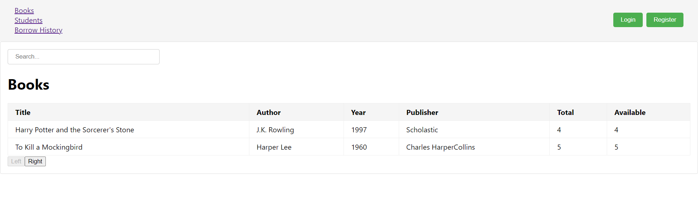
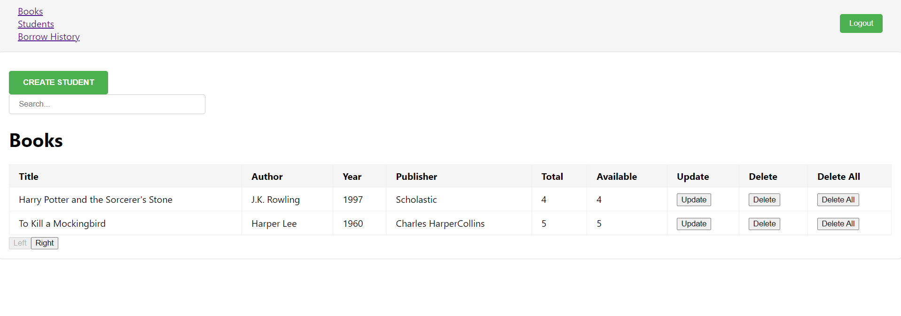

# React Library Project

This React library management system includes features such as pagination, a search bar, and authorization controls. Users can efficiently manage books, student lists, and borrowing history through a user-friendly interface. The system integrates seamlessly with a Spring Boot API, ensuring robust data management and security.
### Example Photo



## Repository for API

The API for this project is available on GitHub. You can find it [here](https://github.com/yasinunl/library). You should take a look.

## Folder Structure


The project is structured as follows:

- `container/`: Contains components for book list, borrowed history, and student list.
- `component/`: Contains individual components for list items, update modal, create components for each list and login and register modals,.
- `auth/`: Contains authentication related files, including AuthContext and custom hooks.
- `service/`: Contains service files for API operations such as getAll, update, delete, and create.

## Authentication

The authentication system is managed using React context and custom hooks. The `AuthContext` provides the authentication state, including whether the user is logged in, user details, and role.

```javascript
// Check app.js for provider
const initialState = {
    isLoggedIn: false,
    user: null, // Or an empty object for user details
    role: null,
};

export const AuthContext = React.createContext(initialState);
export const useAuth = () => { ... 

 const login = (user) => {
        setAuthState({ isLoggedIn: true, "user": user.token, "role": user.role });
        localStorage.setItem('authState', JSON.stringify({ isLoggedIn: true, "token": user.token, "role": user.role }));
    };

}
```

## Service Operations

The `service/` folder contains functions for interacting with the API:

```javascript
// Retrieves all data from the API.
const getAll = () => { ... }

// Updates existing data on the API.
const update = (data, token) => { ... }

// Deletes data from the API.
const delete = (id, token) => { ... }

// Creates new data entries on the API.
const create = (data) => { ... }
```

## Usage
To use this library project:

1. Before starting, start api
1. Clone the repository.
1. Install dependencies using npm install.
1. Start the development server with npm start.

Make sure to set up the API project and configure the endpoints accordingly in the React project.